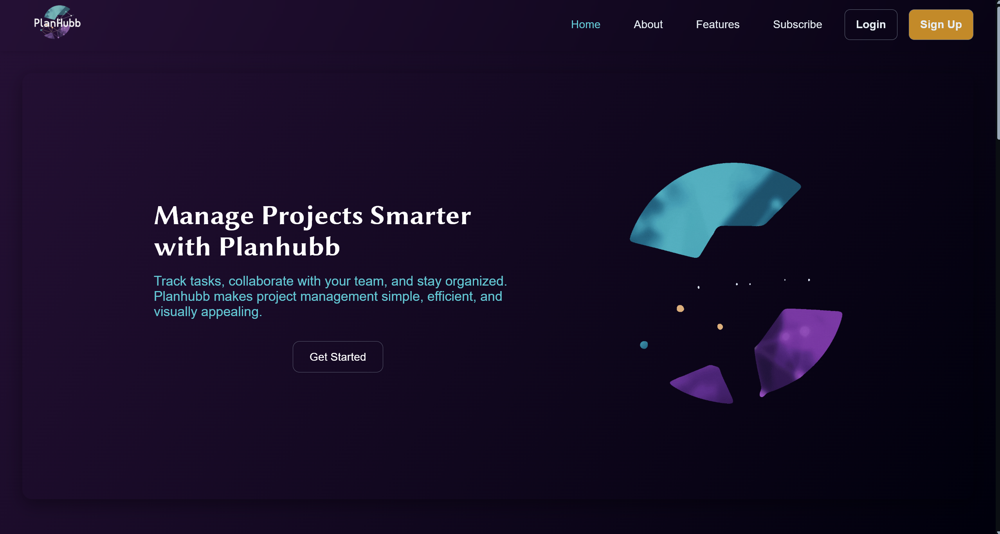
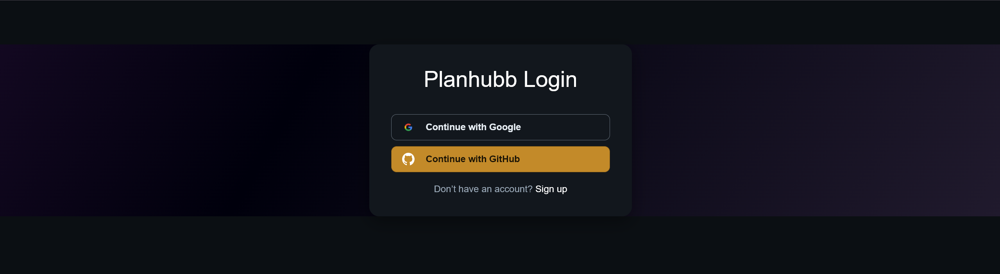
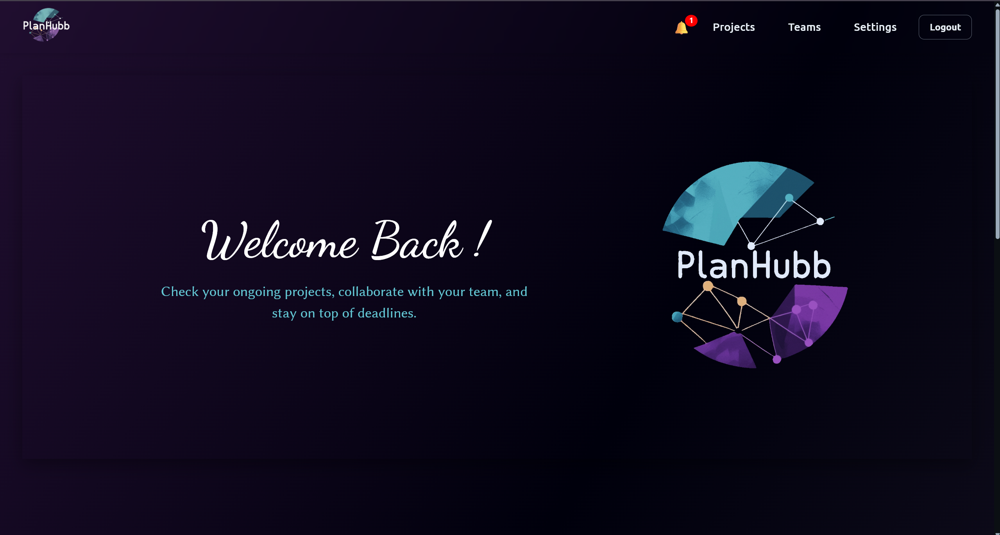
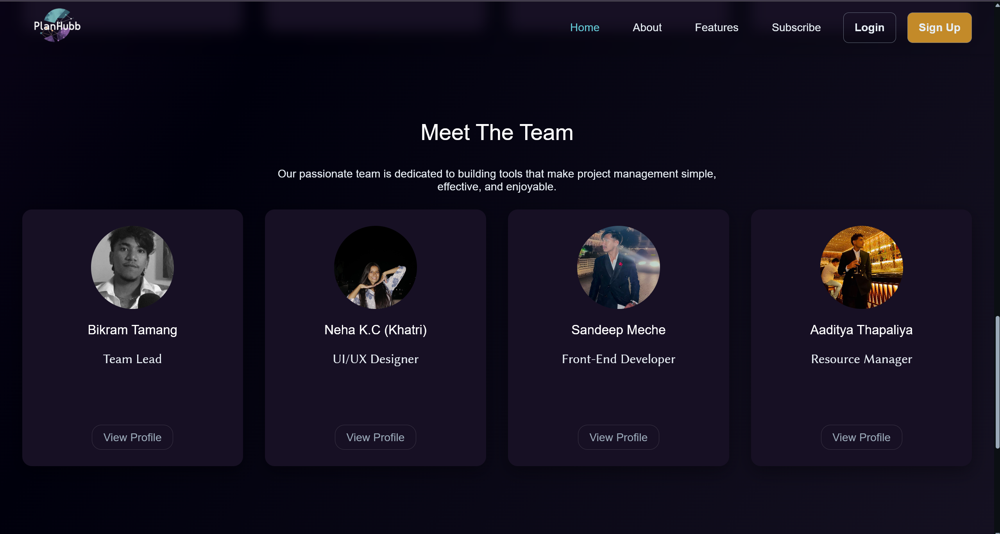
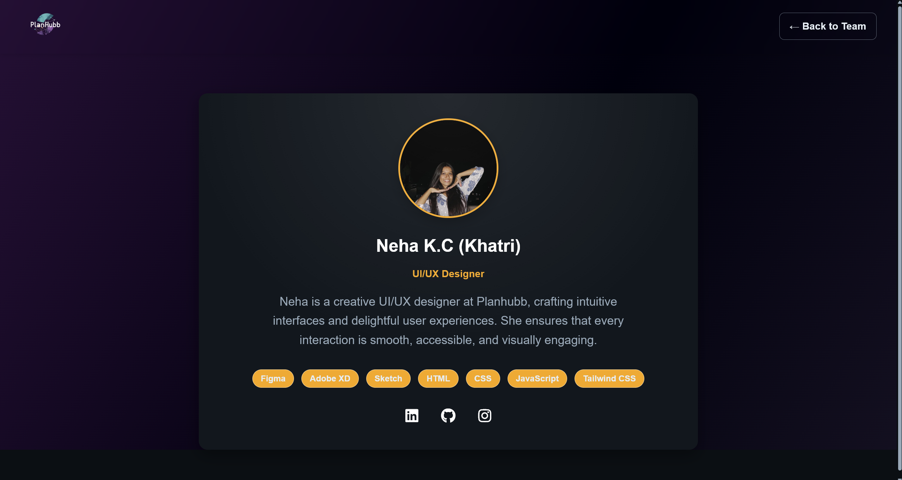
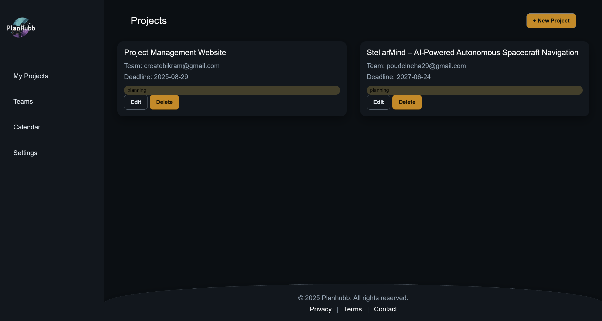
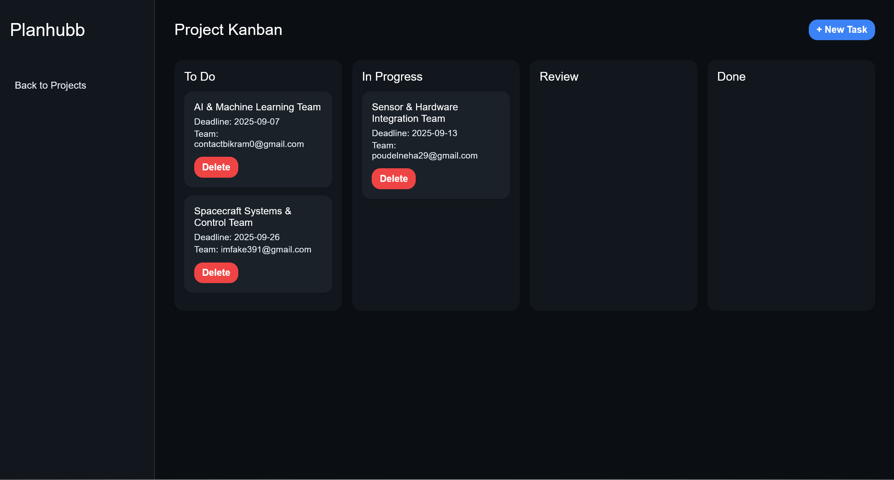
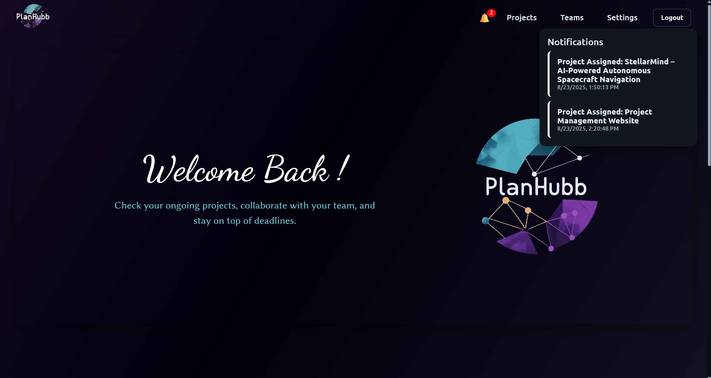
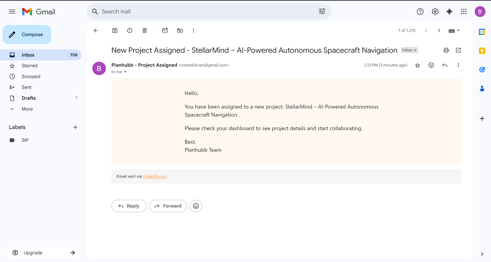
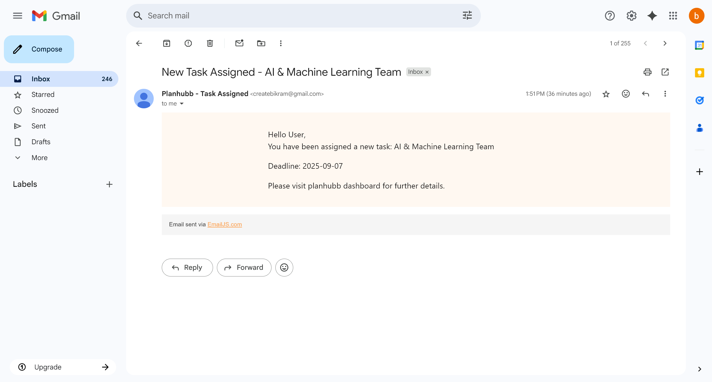

<h1 align="center">🌐 Planhubb – Project Management Website</h1>
<h3 align="center">Collaborative project management made simple, efficient, and modern!</h3>

  <a href="https://github.com/BikramXvi/Planhubb-Project-Management-Website" target="_blank">GitHub Repository</a> |
  <a href="https://planhubb.netlify.app/" target="_blank">Live Demo</a>

---

<h2>📖 Project Description</h2>

Planhubb is a <b>modern project management website</b> built to simplify teamwork and boost productivity. It provides features like <b>user authentication using Firebase Authentication</b>, secure project storage using <b>Firebase Firestore</b>, real-time collaboration, and task management.

<h3>Key Features</h3>
<ul>
  <li><b>User Authentication (Firebase)</b> – Email/Password, Google & GitHub login</li>
  <li><b>Firestore Database</b> – Secure and real-time data storage</li>
  <li><b>Auth Guard</b> – Protects private pages from unauthorized access</li>
  <li><b>Project Boards</b> – Create and manage multiple projects</li>
  <li><b>Task Tracking</b> – Assign, update, and monitor tasks</li>
  <li><b>Modern UI</b> – Light/Dark mode with responsive design</li>
  <li><b>Email JS Integration</b> – Dynamic Email Sending upto 200 free emails per day</li>
  <li><b>Notification</b> – In App Dynamic Notification Feature to the Assigned Users</li>
</ul>

---

<h2>⚙️ Setup Instructions</h2>

<h3>Clone the repository</h3>
<pre>
<code>git clone https://github.com/BikramXvi/Planhubb-Project-Management-Website.git
cd Planhubb-Project-Management-Website
</code>
</pre>

<h3>Configure Firebase</h3>
<ul>
  <li>Go to <i>Firebase Console</i></li>
  <li>Create a new project</li>
  <li>Enable <i>Authentication</i> & <i>Firestore Database</i></li>
  <li>Add your Firebase config to <code>config.js</code></li>
</ul>

<pre>
<code>export const firebaseConfig = {
  apiKey: "YOUR_API_KEY",
  authDomain: "YOUR_PROJECT_ID.firebaseapp.com",
  projectId: "YOUR_PROJECT_ID",
  storageBucket: "YOUR_PROJECT_ID.appspot.com",
  messagingSenderId: "YOUR_SENDER_ID",
  appId: "YOUR_APP_ID"
};
</code>
</pre>

<h3>Run the project</h3>

Open <code>index.html</code> in your browser (or use a local server such as <i>VS Code Live Server</i>).

---

<h2>👥 Contributors</h2>
<ul>
  <li><a href="https://github.com/BikramXvi"><b>Bikram Tamang</b></a> – Project Lead & Developer</li>
  <li><a href="https://github.com/Neha662005"><b>Neha K.C (Khatri)</b></a> – Frontend Developer</li>
  <li><a href="https://github.com/gituser-sandip"><b>Sandeep Meche</b></a> – Firebase Developer</li>
  <li><a href="https://github.com/Aaditya-cell"><<b>Aaditya Thapaliya</b> – UI/UX Designer</li>
</ul>

---

<h2>📸 Screenshots / Demo</h2>

*(Replace image-path-or-URL with your actual screenshots)*

<h3>Landing Page</h3>

<h3>Login Page</h3>

<h3>Home Page (Only accessible after login)</h3>

<h3>All Team Section</h3>

<h3>Individual Team Page</h3>

<h3>Projects Page (only accessible after Login)</h3>

<h3>Tasks Page (only accessible after Login)</h3>

<h3>Dynamic Notification</h3>

<h3>emailjs - Email Integration for Project Assigned</h3>

<h3>emailjs - Email Integration for Task Assigned</h3>

